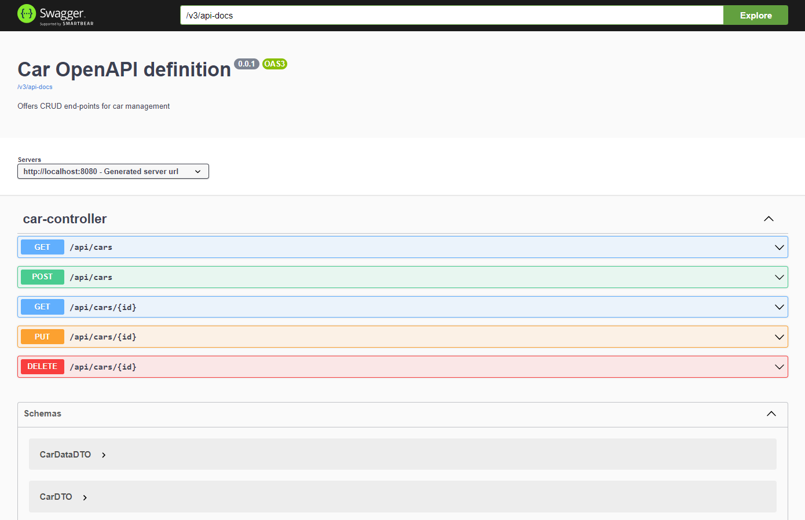

# Overview
This project __cars-api__ is a Spring Boot Server. It provides a standard RESTful API for CRUD operation on a car collection via following end-points:
- `GET /api/cars` - get data about all cars
- `GET api/cars?minPrice=10000&maxPrice=50000` - get data about all cars in a given price range
- `GET api/cars/{carId}` - get data about the specified car
- `PUT api/cars/{carId}` - update/modify data about the specified car
- `DELETE api/cars/{carId}` - delete the specified car
- `POST api/cars` - add a new car

This project was written during a recruitment. 

## Build
Build the project as any standard gradle project from command-line:

    ./gradlew build

## Run
Start your server as a simple java application directly from command-line:

    java -jar build/libs/demo-0.0.1-SNAPSHOT.jar

## Swagger UI
You can view the REST API in swagger-ui by pointing to
http://localhost:8080/swagger-ui.html

### Screenshot
Here's a screenshot of the Swagger UI in action:


## Configuration
The configuration could be done by placing a custom application.properties file in the same folder as app-rating-0.0.1-SNAPSHOT.jar.
Default config is shown below:
```properties
spring.datasource.url=jdbc:h2:mem:testdb
spring.datasource.driverClassName=org.h2.Driver
spring.datasource.username=sa
spring.datasource.password=password
spring.jpa.database-platform=org.hibernate.dialect.H2Dialect
spring.jpa.hibernate.ddl-auto=none
spring.h2.console.enabled=true

spring.jpa.show-sql=true
logging.level.org.hibernate.SQL=DEBUG

springdoc.swagger-ui.operationsSorter=alpha
```

## H2 Console
After running the application, the database can be accessed via H2 Database Console. The web-based interface is available at: [http://localhost:8080/h2-console](http://localhost:8080/h2-console)

## Database Schema
The schema is defined by one Hibernate entity class

### Car Entity

```java
@Entity
@Getter
@Setter
@Table(name = "cars")
@AllArgsConstructor
@NoArgsConstructor
public class Car {

  @Id
  @GeneratedValue(strategy = GenerationType.IDENTITY)
  private Long id;

  @Column(name = "brand_name")
  private String brandName;

  @Column(name = "model")
  private String model;

  @Column(name = "production_year")
  private Long productionYear;

  @Column(name = "price")
  private BigDecimal price;

  @Column(name = "color")
  private String color;

}
```
| Field          | Type          | Description                      | Technical Details      |
|----------------|---------------|----------------------------------|------------------------|
| id             | Long          | Primary key                      | IDENTITY               |
| brandName      | String        | Brand name of the car            |                        |
| model          | String        | Model of the car                 |                        |
| productionYear | Long          | Year the car was produced        |                        |
| price          | BigDecimal    | Price of the car                 |                        |
| color          | String        | Color of the car                 |                        |

## Database Queries

Database queries are done using Spring Data repositories.

```java
@Repository
public interface CarRepository extends JpaRepository<Car, Long> {
    List<Car> findByPriceBetween(BigDecimal minPrice, BigDecimal maxPrice);
}
```

## Data Transfer Objects (DTOs)
DTOs are created using __mapstruct__ library.  

```java
@Mapper
public interface CarMapper {

    CarMapper INSTANCE = Mappers.getMapper(CarMapper.class);

    @Mapping(target = "id", ignore = true) // Ignore id during mapping
    Car mapToEntity(CarDTO carDTO);

    CarDTO mapToDTO(Car car);

    List<CarDTO> mapToDTOs(List<Car> cars);
}
```